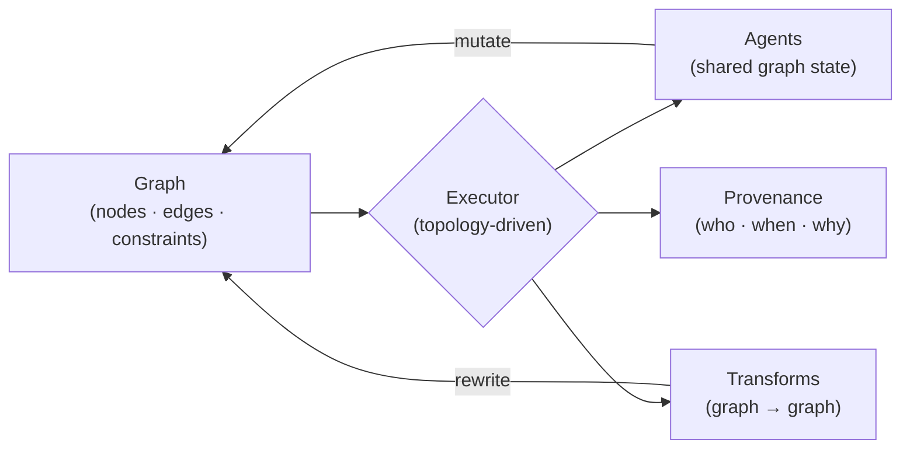

# Xepayac LLC

[](LICENSE)
[](https://github.com/Xepayac/XEPAYAC_LLC/actions/workflows/compliance.yml)
[](#patent)
[](mailto:xepayacllc@gmail.com?subject=SGS%20Commercial%20License)

**Research publication and commercial licensing for the Superseding Graph Substrate (SGS).**

This repository is Xepayac LLC's research publication of SGS. The Python implementation and the research studies in this repo establish the invention publicly. SGS is U.S. patent application **19/575,491**.

- **Reference implementation** (Python, this repo) — available under **AGPL-3.0** for research, evaluation, and open-source use
- **Commercial deployment** — requires a license from Xepayac LLC ([contact](mailto:xepayacllc@gmail.com?subject=SGS%20Commercial%20License))
- **Commercial product** (Go, forthcoming) — ships as the performant, enterprise-targeted implementation

The Python code is the *evidence*. The Go product is what you buy.

## SGS in one diagram



The graph is the program. The executor walks it topology-first. Agents share state by mutating the graph, not by message passing. Transforms are graph-to-graph rewrites. Provenance records every mutation.

## Running the reference implementation

The reference code is intentionally not on PyPI. Install from source for research or evaluation:

```bash
pip install git+https://github.com/Xepayac/XEPAYAC_LLC.git
```

Or clone and run the studies directly:

```bash
git clone https://github.com/Xepayac/XEPAYAC_LLC.git
cd XEPAYAC_LLC
pip install -e .
pytest studies/
```

Requires Python 3.9+. See [`examples/`](examples/) for API patterns and [`studies/`](studies/) for the capability experiments.

---

## What We Build

### Custom Chatbots
Powered by structured knowledge graphs — not vector databases, not RAG pipelines, not embedding models. We crawl your content, build a knowledge graph, and serve a chatbot that answers from structured data. It doesn't hallucinate because it only answers from what it knows.

**For small businesses:** Give us your website, we give you a chatbot.

**For enterprises:** Multi-agent orchestration across business domains. One chatbot that routes questions to the right department, synthesizes cross-domain answers, and maintains conversation context. Sales, support, HR, engineering — each domain is a knowledge graph. The orchestrator sits on top.

### Technology Licensing
The Superseding Graph Substrate (SGS) is available for commercial licensing:

- **Graph execution** — topology-driven computation where the graph itself is the program
- **Multi-agent coordination** — agents communicate through shared graph state, not message passing
- **Self-modification** — graphs that transform themselves during execution
- **Knowledge graph construction** — automated crawl, extract, build pipelines

### SaltWind (In Development)
An LLM-native role-playing game built on our own technology. The chatbot platform IS the game master. The multi-agent orchestrator runs the NPCs. The knowledge graphs hold the world, the rules, and the story.

SaltWind proves the technology. If our platform can run a role-playing game — with real-time combat, emergent narrative, and multiple autonomous agents — it can run your business.

---

## Superseding Graph Substrate (SGS)

SGS is the concept of graph-as-executable-program. The graph is not a description of a program — it *is* the program.

Three pillars:

1. **Topology-driven execution** — computation order is determined by graph structure, not sequential instruction
2. **Self-modification** — the graph transforms itself during execution, enabling adaptive behavior
3. **Multi-agent coordination** — multiple agents operate on shared graph state, communicating through structure rather than messages

## SGS Studies

This repository contains 16 studies demonstrating that SGS technology exists and works. Each study is an independent proof of a specific capability.

| Study | Domain |
|---|---|
| STUDY-101 | Multi-agent coordination via graph substrate |
| STUDY-102 | Topology-driven execution ordering |
| STUDY-103 | Executable node types |
| STUDY-104 | Process isolation between agents |
| STUDY-105 | Graph partitioning for multi-party computation |
| STUDY-106 | Graph serialization and deserialization |
| STUDY-107 | Nested graph hierarchies |
| STUDY-109 | Graph self-modification during execution |
| STUDY-110 | Value exchange between agents |
| STUDY-111 | Autonomous decision-making via graph state |
| STUDY-120 | Result-dependent edge selection |
| STUDY-122 | Traversal pathway computation |
| STUDY-125 | Incremental scaling of graph execution |
| STUDY-126 | Agent memory via persistent graph state |
| STUDY-135 | Atomic transactions on graph structures |
| STUDY-180 | Living graphs — continuous self-updating structures |

---

## License

Everything in this repository is licensed under the **GNU Affero General Public License v3.0** (AGPL 3.0).

Commercial use of SGS technology outside the terms of the AGPL 3.0 requires a commercial license from Xepayac LLC.

## Patent

Superseding Graph Substrate is the subject of U.S. patent application 19/575,491.

## Contact

**Chatbot inquiries:** [xepayacllc@gmail.com](mailto:xepayacllc@gmail.com)
**Technology licensing:** [xepayacllc@gmail.com](mailto:xepayacllc@gmail.com)
**General:** [xepayacllc@gmail.com](mailto:xepayacllc@gmail.com)

## This repo, as a TRUG

We eat our own dog food. [`folder.trug.json`](folder.trug.json) at the repo root is the machine-readable index — every component folder, every doc, every license file has a node; typed edges capture which module depends on which.

```bash
# What does this repo ship?
trugs-tls folder.trug.json

# Does the graph match the filesystem?
trugs-folder-check .
```

CI enforces the graph-filesystem alignment on every PR. If the TRUG drifts, CI fails.

## Related

The **TRUGS Standard** — the open graph storage format used by SGS — is maintained by [TRUGS LLC](https://github.com/TRUGS-LLC/TRUGS) under the Apache License 2.0. Free to use, free to build on.

## Contributing

See [CONTRIBUTING.md](CONTRIBUTING.md). TL;DR: contributors sign the CLA ([CLA.md](CLA.md)) which grants Xepayac LLC dual-license rights. Security issues → [SECURITY.md](SECURITY.md) (private disclosure).
